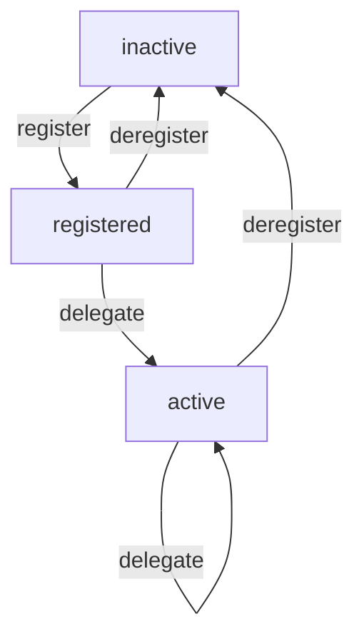

# Delegation store

Delegation store is the history of delegation state indexed by slot.

User is supposed to manage it by sending 2 transactions
1. _stake key registration_ : here the wallet will use this information to bake new addresses with reward accounts
2. _pool id delegation_ : here the wallet will just track the pool we are staking to with the actual staking key

## observations 
1. _delegation state at a slot_: For any slot we can select one of the possible delegation states.

## delegation states

1. _inactive_ : staking is false and no pool identifier present
2. _registered_ : staking is true and no pool identifier present
4. _active_ : staking is true and pool identifier present 

## primitive state changes

All state changes are intended to be expressed at a specific slot.

1. _register/deregister_ : signal the presence / absence of any staking key
2. _delegate_ : signal the choice of a specific pool identifier

## API operations

1. _register from slot_ : as the primitive, rewriting future from the slot
1. _deregister from slot_ : as the primitive, rewriting future from the slot
2. _delegate to pool from slot_ : as the primitive, rewriting future from the slot
4. _rollback to slot_ : rewriting future from the slot, as current state at slot  